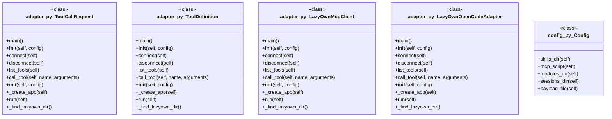

# Polyglot Codebase Knowledge Graph

> Generated offline by **readmenator**. 4 files, 25 symbols, 17 imports. Supports C, C++, Python, Go, Rust, JS/TS, Java, C#, Shell, PHP, Dart, GDScript, Nim, ASM, Ruby, Swift, Kotlin, Scala, Lua, Elixir.
> No LLMs. No tokens. Pure static analysis. See more [here](https://github.com/grisuno/ReadMenator)

**Start here:** Statistics Dashboard for scope, God Nodes for blast radius, Architecture Reference for per-file API. Agents: prefer `readmenator-agent/INDEX.md` + `SYMBOLS.md`.

**Wiki:** prefer `readmenator-wiki/index.md` for progressive disclosure: one synthesis page per community, `connections.json` with EXTRACTED vs INFERRED confidence, `queries.md` log, `REPORT.md` audit.

**Confidence:** EXTRACTED = parsed from source, INFERRED = heuristic bridge, AMBIGUOUS = reported, never hidden. See `readmenator-wiki/REPORT.md`.

**Total Files Parsed:** 4 | **Total Symbols Extracted:** 25 | **Total Imports:** 17
 | **Resolved Imports:** 1

<!-- ranking_model: v1.0 | weights: {ppr:0.45,auth:0.2,test:0.15,doc:0.1,fresh:0.1} | alpha:0.85 | commit:b3ca3bb | date:2026-07-18 -->


## Table of Contents

1. [Statistics Dashboard](#statistics-dashboard)
2. [Architectural Layers](#architectural-layers)
3. [Ranked Context](#ranked-context)
4. [God Nodes](#god-nodes)
5. [Community Analysis](#community-analysis)
6. [Suggested Questions](#suggested-questions)
7. [Hotspot Analysis](#hotspot-analysis)
8. [Change Impact Analysis](#change-impact-analysis)
9. [Suggested Linting Rules](#suggested-linting-rules)
10. [Orphans](#orphans)
11. [Query Recipes](#query-recipes)
12. [Structural Knowledge Map](#structural-knowledge-map)
13. [UML Class Diagram](#uml-class-diagram)
14. [Code Property Graph](#code-property-graph)
15. [Architecture Reference](#architecture-reference)
    - [PY (3 files)](#py-3-files)
    - [SH (1 files)](#sh-1-files)

---

## Statistics Dashboard

| Metric | Value |
|--------|-------|
| Total Files | 4 |
| Total Symbols | 25 |
| Total Imports | 17 |
| Call Edges | 80 |
| Inheritance Edges | 2 |
| Languages | 2 |
| Avg Symbols/File | 6.2 |
| Avg Imports/File | 4.2 |
| Resolved Imports | 1 |

### Top Files by Import Count (Fan-Out)

| File | Imports | Symbols | Language |
|------|---------|---------|----------|
| `adapter.py` | 15 | 19 | py |
| `config.py` | 2 | 6 | py |

---

## Architectural Layers

Auto-detected from path patterns, naming conventions, and imported frameworks.

| Layer | Files |
|-------|-------|
| utility | 2 |
| presentation | 1 |
| infrastructure | 1 |

### presentation

- `adapter.py` (py, 19 symbols)

### utility

- `app.py` (py, 0 symbols)
- `install.sh` (sh, 0 symbols)

### infrastructure

- `config.py` (py, 6 symbols)

---

## Ranked Context

Files ranked by composite score for the current query context. The ranking combines Personalized PageRank (query relevance), global authority, test coverage, documentation coverage, and code freshness. Model: v1.0.

| Rank | File | Composite | PPR | Authority | Test | Doc |
|------|------|-----------|-----|-----------|------|-----|
| 1 | `config.py` | 0.4386 | 0.6491 | 0.6491 | 0.00 | 0.17 |
| 2 | `adapter.py` | 0.3070 | 0.3509 | 0.3509 | 0.00 | 0.79 |
| 3 | `app.py` | 0.1000 | 0.0000 | 0.0000 | 0.00 | 1.00 |
| 4 | `install.sh` | 0.0000 | 0.0000 | 0.0000 | 0.00 | 0.00 |

---

## God Nodes

Most architecturally central files ranked by combined import/export degree and symbol richness.

| File | Score | Connections | PageRank |
|------|-------|-------------|----------|
| `adapter.py` | 3.9 | | 0.3509 |
| `config.py` | 2.6 | | 0.6491 |
| `app.py` | 0.0 | | 0.0000 |
| `install.sh` | 0.0 | | 0.0000 |

---

## Community Analysis

Files grouped by import-based community detection. Cohesion measures how tightly connected each community is internally.

### root (Cohesion: 1.00)

**2 files** in this community:

- `adapter.py` (py, 19 symbols)
- `config.py` (py, 6 symbols)

---

## Suggested Questions

Auto-generated exploration prompts based on graph structure:

- What does adapter.py depend on, and what depends on it? (1 connections)
- What does config.py depend on, and what depends on it? (1 connections)
- What does app.py depend on, and what depends on it? (0 connections)
- What is ToolCallRequest in adapter.py and how is it used?
- What is Config in config.py and how is it used?

---

## Hotspot Analysis

Files ranked by combined complexity (symbol count) and centrality (connection count). High-scoring files are architecturally critical and may need refactoring attention.

| File | Complexity | Centrality | Combined | Symbols | Connections |
|------|-----------|------------|----------|---------|-------------|
| `config.py` | 0.316 | 0.188 | 0.239 | 6 | 3 |
| `adapter.py` | 1.000 | 1.000 | 1.000 | 19 | 16 |
| `app.py` | 0.000 | 0.000 | 0.000 | 0 | 0 |
| `install.sh` | 0.000 | 0.000 | 0.000 | 0 | 0 |

---

## Change Impact Analysis

Files sorted by how many other files would be affected if they changed. High-impact files should be changed with caution.

| File | Direct Dependents | Transitive Dependents | Total Impact |
|------|------------------|----------------------|--------------|
| `config.py` | 1 | 0 | 1 |
| `adapter.py` | 0 | 0 | 0 |
| `app.py` | 0 | 0 | 0 |
| `install.sh` | 0 | 0 | 0 |

---

## Suggested Linting Rules

Automatically suggested linting and security rules based on patterns detected in the codebase. These can be exported as Semgrep rules using the `--export-rules` flag.

| Rule ID | Severity | Description | Language | Matches |
|---------|----------|-------------|----------|---------|
| `RM001` | info | Large number of functions in py: 20 total | py | 20 |

---

## Orphans

Files with no documentation or low connectivity. These are candidates for documentation investment or cleanup.

- `install.sh` (0 symbols, no doc)

---

## Query Recipes

Example queries you can run against this knowledge base using the ranking engine:

```
# Find files most relevant to a concept
readmenator query "Where is the import resolver implemented?"

# Rank files by relevance to a topic
readmenator query "How does documentation generation work?"

# Explain why a file ranks highly
readmenator query "explain readmenator/_documentation.py"

# Trace dependency paths with ranked context
readmenator query "path from CLI to exporter"
```

The ranking model uses the following signals:

- **Personalized PageRank** (45% weight): query-specific relevance via seed propagation
- **Global Authority** (20% weight): structural importance via standard PageRank
- **Test Coverage** (15% weight): fraction of symbols referenced in test files
- **Doc Coverage** (10% weight): presence of docstrings and file-level docs
- **Freshness** (10% weight): recent modification activity

Results include score decomposition and justification paths for each ranked item.

---

## Structural Knowledge Map

```mermaid
graph TD
    classDef mod fill:#1e1e1e,stroke:#ff6666,stroke-width:2px,color:#fff;
    classDef cls fill:#2d2d2d,stroke:#4ec9b0,stroke-width:2px,color:#fff;
    classDef fn fill:#333,stroke:#dcdcaa,stroke-width:1px,color:#dcdcaa;
    classDef ext fill:#111,stroke:#666,stroke-dasharray:5 5,color:#aaa;
    subgraph community_0 ["root"]
    adapter_py["adapter.py (py)"]
    class adapter_py mod;
    adapter_py_ToolCallRequest["ToolCallRequest"]
    class adapter_py_ToolCallRequest cls;
    adapter_py --> adapter_py_ToolCallRequest
    adapter_py_ToolDefinition["ToolDefinition"]
    class adapter_py_ToolDefinition cls;
    adapter_py --> adapter_py_ToolDefinition
    adapter_py_LazyOwnMcpClient["LazyOwnMcpClient"]
    class adapter_py_LazyOwnMcpClient cls;
    adapter_py --> adapter_py_LazyOwnMcpClient
    adapter_py_LazyOwnOpenCodeAdapter["LazyOwnOpenCodeAdapter"]
    class adapter_py_LazyOwnOpenCodeAdapter cls;
    adapter_py --> adapter_py_LazyOwnOpenCodeAdapter
    adapter_py_main["main"]
    class adapter_py_main fn;
    adapter_py --> adapter_py_main
    config_py["config.py (py)"]
    class config_py mod;
    app_py["app.py (py)"]
    class app_py mod;
    install_sh["install.sh (sh)"]
    class install_sh mod;
    end
    adapter_py -- resolved_imports --> config_py
    ext_asyncio["asyncio"]
    class ext_asyncio ext;
    adapter_py -.->|imports| ext_asyncio
    ext_json["json"]
    class ext_json ext;
    adapter_py -.->|imports| ext_json
    ext_logging["logging"]
    class ext_logging ext;
    adapter_py -.->|imports| ext_logging
    ext_os["os"]
    class ext_os ext;
    adapter_py -.->|imports| ext_os
    ext_sys["sys"]
    class ext_sys ext;
    adapter_py -.->|imports| ext_sys
    ext_contextlib["contextlib"]
    class ext_contextlib ext;
    adapter_py -.->|imports| ext_contextlib
    ext_typing["typing"]
    class ext_typing ext;
    adapter_py -.->|imports| ext_typing
    ext_fastapi["fastapi"]
    class ext_fastapi ext;
    adapter_py -.->|imports| ext_fastapi
    ext_pydantic["pydantic"]
    class ext_pydantic ext;
    adapter_py -.->|imports| ext_pydantic
    ext_mcp["mcp"]
    class ext_mcp ext;
    adapter_py -.->|imports| ext_mcp
    ext_mcp_client_stdio["mcp.client.stdio"]
    class ext_mcp_client_stdio ext;
    adapter_py -.->|imports| ext_mcp_client_stdio
    ext_config["config"]
    class ext_config ext;
    adapter_py -.->|imports| ext_config
    ext_argparse["argparse"]
    class ext_argparse ext;
    adapter_py -.->|imports| ext_argparse
    ext_pathlib["pathlib"]
    class ext_pathlib ext;
    adapter_py -.->|imports| ext_pathlib
    ext_uvicorn["uvicorn"]
    class ext_uvicorn ext;
    adapter_py -.->|imports| ext_uvicorn
    ext_dataclasses["dataclasses"]
    class ext_dataclasses ext;
    config_py -.->|imports| ext_dataclasses
    config_py -.->|imports| ext_pathlib
```



---

## UML Class Diagram

Auto-generated Mermaid class diagram from parsed class-level symbols. Shows classes, structs, interfaces, traits, and their methods with inheritance and dependency relationships.



---

## Code Property Graph

Machine-readable Code Property Graph (CPG) in JSON-LD format. This block allows AI agents to parse the full structural graph without additional file reads. Compatible with GraphRAG pipelines.

```json
{"@context": "https://schema.org", "analysis": {"communities": [{"cohesion": 1.0, "id": 0, "label": "root", "size": 2}], "god_nodes": [{"node_id": "adapter.py", "score": 3.9}, {"node_id": "config.py", "score": 2.6}, {"node_id": "app.py", "score": 0.0}, {"node_id": "install.sh", "score": 0.0}], "surprising_connections": []}, "edges": [{"confidence": "EXTRACTED", "relation": "imports", "source": "adapter.py", "target": "asyncio"}, {"confidence": "EXTRACTED", "relation": "imports", "source": "adapter.py", "target": "json"}, {"confidence": "EXTRACTED", "relation": "imports", "source": "adapter.py", "target": "logging"}, {"confidence": "EXTRACTED", "relation": "imports", "source": "adapter.py", "target": "os"}, {"confidence": "EXTRACTED", "relation": "imports", "source": "adapter.py", "target": "sys"}, {"confidence": "EXTRACTED", "relation": "imports", "source": "adapter.py", "target": "contextlib"}, {"confidence": "EXTRACTED", "relation": "imports", "source": "adapter.py", "target": "typing"}, {"confidence": "EXTRACTED", "relation": "imports", "source": "adapter.py", "target": "fastapi"}, {"confidence": "EXTRACTED", "relation": "imports", "source": "adapter.py", "target": "pydantic"}, {"confidence": "EXTRACTED", "relation": "imports", "source": "adapter.py", "target": "mcp"}, {"confidence": "EXTRACTED", "relation": "imports", "source": "adapter.py", "target": "mcp.client.stdio"}, {"confidence": "EXTRACTED", "relation": "imports", "source": "adapter.py", "target": "config"}, {"confidence": "EXTRACTED", "relation": "imports", "source": "adapter.py", "target": "argparse"}, {"confidence": "EXTRACTED", "relation": "imports", "source": "adapter.py", "target": "pathlib"}, {"confidence": "EXTRACTED", "relation": "imports", "source": "adapter.py", "target": "uvicorn"}, {"confidence": "EXTRACTED", "relation": "imports", "source": "config.py", "target": "dataclasses"}, {"confidence": "EXTRACTED", "relation": "imports", "source": "config.py", "target": "pathlib"}, {"confidence": "EXTRACTED", "relation": "resolved_imports", "source": "adapter.py", "target": "config.py"}], "generator": "readmenator", "metadata": {"edge_count": 100, "file_count": 4, "language_count": 2, "symbol_count": 25}, "nodes": [{"id": "adapter.py", "kind": "module", "label": "adapter.py", "language": "py", "sha256": "a79bc24f7d1267be", "symbol_count": 19, "symbols": [{"doc": "Request body for executing a tool by name.", "kind": "class", "line": 20, "name": "ToolCallRequest", "signature": "class ToolCallRequest(BaseModel)"}, {"doc": "OpenAI-compatible function definition.", "kind": "class", "line": 27, "name": "ToolDefinition", "signature": "class ToolDefinition(BaseModel)"}, {"doc": "Client for the LazyOwn MCP server.\n\nManages a persistent stdio connection to the LazyOwn MCP server,\nproviding methods to list and call tools via the Model Context Protocol.", "kind": "class", "line": 35, "name": "LazyOwnMcpClient", "signature": "class LazyOwnMcpClient"}, {"doc": "Adapter that exposes LazyOwn MCP tools as OpenAI-compatible functions.\n\nThis adapter bridges the LazyOwn MCP server with OpenCode and other\nOpenAI-compatible clients by translating tool schemas and providing\na REST interface for tool discovery and execution.", "kind": "class", "line": 107, "name": "LazyOwnOpenCodeAdapter", "signature": "class LazyOwnOpenCodeAdapter"}, {"doc": "Entry point for the adapter CLI.", "kind": "method", "line": 185, "name": "main", "signature": "def main()"}, {"kind": "method", "line": 43, "name": "__init__", "signature": "def __init__(self, config)"}, {"doc": "Establish a stdio connection to the LazyOwn MCP server.", "kind": "method", "line": 49, "name": "connect", "signature": "def connect(self)"}, {"doc": "Close the connection to the LazyOwn MCP server.", "kind": "method", "line": 69, "name": "disconnect", "signature": "def disconnect(self)"}, {"doc": "List all available tools from the LazyOwn MCP server.", "kind": "method", "line": 79, "name": "list_tools", "signature": "def list_tools(self)"}, {"doc": "Call a tool by name with the given arguments.", "kind": "method", "line": 98, "name": "call_tool", "signature": "def call_tool(self, name, arguments)"}, {"kind": "method", "line": 116, "name": "__init__", "signature": "def __init__(self, config)"}, {"doc": "Create and configure the FastAPI application.", "kind": "method", "line": 121, "name": "_create_app", "signature": "def _create_app(self)"}, {"doc": "Start the adapter HTTP server.", "kind": "method", "line": 168, "name": "run", "signature": "def run(self)"}, {"kind": "method", "line": 191, "name": "_find_lazyown_dir", "signature": "def _find_lazyown_dir()"}, {"kind": "method", "line": 125, "name": "lifespan", "signature": "def lifespan(app)"}, {"doc": "Health check endpoint.", "kind": "method", "line": 138, "name": "health", "signature": "def health()"}, {"doc": "List all available LazyOwn tools in OpenAI function format.", "kind": "method", "line": 143, "name": "list_tools", "signature": "def list_tools()"}, {"doc": "Execute a LazyOwn tool by name with the provided arguments.", "kind": "method", "line": 148, "name": "call_tool", "signature": "def call_tool(request)"}, {"doc": "Return the current adapter configuration.", "kind": "method", "line": 158, "name": "get_config", "signature": "def get_config()"}]}, {"doc": "app.py  Autor: Gris Iscomeback Correo electrónico: grisiscomeback[at]gmail[dot]com Fecha de creación: xx/xx/xxxx Licencia: GPL v3  Descripción:", "id": "app.py", "kind": "module", "label": "app.py", "language": "py", "sha256": "57b21bdb023585b8", "symbol_count": 0, "symbols": []}, {"id": "config.py", "kind": "module", "label": "config.py", "language": "py", "sha256": "f583da47ca44f2fb", "symbol_count": 6, "symbols": [{"doc": "Configuration for the LazyOwn OpenCode adapter.\n\nAll paths are resolved relative to the LazyOwn installation directory.\nNo absolute paths are hardcoded, making the adapter portable across\ndifferent machines and installations.", "kind": "class", "line": 6, "name": "Config", "signature": "class Config"}, {"kind": "method", "line": 22, "name": "skills_dir", "signature": "def skills_dir(self)"}, {"kind": "method", "line": 26, "name": "mcp_script", "signature": "def mcp_script(self)"}, {"kind": "method", "line": 30, "name": "modules_dir", "signature": "def modules_dir(self)"}, {"kind": "method", "line": 34, "name": "sessions_dir", "signature": "def sessions_dir(self)"}, {"kind": "method", "line": 38, "name": "payload_file", "signature": "def payload_file(self)"}]}, {"id": "install.sh", "kind": "module", "label": "install.sh", "language": "sh", "sha256": "c907d80fd6734993", "symbol_count": 0, "symbols": []}], "type": "CodePropertyGraph", "version": "1.0"}
```

---

## Architecture Reference

### PY (3 files)

#### `adapter.py`
**Path:** `adapter.py`

**Classes:**
- `ToolCallRequest` (line 20) `class ToolCallRequest(BaseModel)` - *Request body for executing a tool by name.*
- `ToolDefinition` (line 27) `class ToolDefinition(BaseModel)` - *OpenAI-compatible function definition.*
- `LazyOwnMcpClient` (line 35) `class LazyOwnMcpClient` - *Client for the LazyOwn MCP server.

Manages a persistent stdio connection to the LazyOwn MCP server,
providing methods to list and call tools via the Model Context Protocol.*
- `LazyOwnOpenCodeAdapter` (line 107) `class LazyOwnOpenCodeAdapter` - *Adapter that exposes LazyOwn MCP tools as OpenAI-compatible functions.

This adapter bridges the LazyOwn MCP server with OpenCode and other
OpenAI-compatible clients by translating tool schemas and providing
a REST interface for tool discovery and execution.*

**Methods:**
- `main` (line 185) `def main()` - *Entry point for the adapter CLI.*
- `__init__` (line 43) `def __init__(self, config)`
- `connect` (line 49) `def connect(self)` - *Establish a stdio connection to the LazyOwn MCP server.*
- `disconnect` (line 69) `def disconnect(self)` - *Close the connection to the LazyOwn MCP server.*
- `list_tools` (line 79) `def list_tools(self)` - *List all available tools from the LazyOwn MCP server.*
- `call_tool` (line 98) `def call_tool(self, name, arguments)` - *Call a tool by name with the given arguments.*
- `__init__` (line 116) `def __init__(self, config)`
- `_create_app` (line 121) `def _create_app(self)` - *Create and configure the FastAPI application.*
- `run` (line 168) `def run(self)` - *Start the adapter HTTP server.*
- `_find_lazyown_dir` (line 191) `def _find_lazyown_dir()`
- `lifespan` (line 125) `def lifespan(app)`
- `health` (line 138) `def health()` - *Health check endpoint.*
- `list_tools` (line 143) `def list_tools()` - *List all available LazyOwn tools in OpenAI function format.*
- `call_tool` (line 148) `def call_tool(request)` - *Execute a LazyOwn tool by name with the provided arguments.*
- `get_config` (line 158) `def get_config()` - *Return the current adapter configuration.*

#### `app.py`
**Path:** `app.py`
**File Doc:** *app.py  Autor: Gris Iscomeback Correo electrónico: grisiscomeback[at]gmail[dot]com Fecha de creación: xx/xx/xxxx Licencia: GPL v3  Descripción:*

*No symbols extracted*

#### `config.py`
**Path:** `config.py`

**Classes:**
- `Config` (line 6) `class Config` - *Configuration for the LazyOwn OpenCode adapter.

All paths are resolved relative to the LazyOwn installation directory.
No absolute paths are hardcoded, making the adapter portable across
different machines and installations.*

**Methods:**
- `skills_dir` (line 22) `def skills_dir(self)`
- `mcp_script` (line 26) `def mcp_script(self)`
- `modules_dir` (line 30) `def modules_dir(self)`
- `sessions_dir` (line 34) `def sessions_dir(self)`
- `payload_file` (line 38) `def payload_file(self)`

### SH (1 files)

#### `install.sh`
**Path:** `install.sh`

*No symbols extracted*
