# Polyglot Codebase Knowledge Graph

> Generated offline by **readmenator**. Supports C, C++, Python, Go, Rust, JS/TS, Java, C#, Shell, PHP, Dart, GDScript, Nim, ASM.
> No LLMs. No tokens. Pure static analysis. See more [here](https://github.com/grisuno/ReadMenator)

**Total Files Parsed:** 4 | **Total Symbols Extracted:** 25 | **Total Imports:** 17

## Structural Knowledge Map

```mermaid
graph TD
    classDef mod fill:#1e1e1e,stroke:#ff6666,stroke-width:2px,color:#fff;
    classDef cls fill:#2d2d2d,stroke:#4ec9b0,stroke-width:2px,color:#fff;
    classDef fn fill:#333,stroke:#dcdcaa,stroke-width:1px,color:#dcdcaa;
    classDef ext fill:#111,stroke:#666,stroke-dasharray:5 5,color:#aaa;
    adapter_py["adapter.py (py)"]
    class adapter_py mod;
    adapter_py_ToolCallRequest["ToolCallRequest"]
    class adapter_py_ToolCallRequest cls;
    adapter_py --> adapter_py_ToolCallRequest
    adapter_py_ToolDefinition["ToolDefinition"]
    class adapter_py_ToolDefinition cls;
    adapter_py --> adapter_py_ToolDefinition
    adapter_py_LazyOwnMcpClient["LazyOwnMcpClient"]
    class adapter_py_LazyOwnMcpClient cls;
    adapter_py --> adapter_py_LazyOwnMcpClient
    adapter_py_LazyOwnOpenCodeAdapter["LazyOwnOpenCodeAdapter"]
    class adapter_py_LazyOwnOpenCodeAdapter cls;
    adapter_py --> adapter_py_LazyOwnOpenCodeAdapter
    adapter_py_main["main"]
    class adapter_py_main fn;
    adapter_py --> adapter_py_main
    config_py["config.py (py)"]
    class config_py mod;
    config_py_Config["Config"]
    class config_py_Config cls;
    config_py --> config_py_Config
    config_py_skills_dir["skills_dir"]
    class config_py_skills_dir fn;
    config_py --> config_py_skills_dir
    config_py_mcp_script["mcp_script"]
    class config_py_mcp_script fn;
    config_py --> config_py_mcp_script
    config_py_modules_dir["modules_dir"]
    class config_py_modules_dir fn;
    config_py --> config_py_modules_dir
    config_py_sessions_dir["sessions_dir"]
    class config_py_sessions_dir fn;
    config_py --> config_py_sessions_dir
    app_py["app.py (py)"]
    class app_py mod;
    install_sh["install.sh (sh)"]
    class install_sh mod;
    ext_asyncio["asyncio"]
    class ext_asyncio ext;
    adapter_py -.->|imports| ext_asyncio
    ext_json["json"]
    class ext_json ext;
    adapter_py -.->|imports| ext_json
    ext_logging["logging"]
    class ext_logging ext;
    adapter_py -.->|imports| ext_logging
    ext_os["os"]
    class ext_os ext;
    adapter_py -.->|imports| ext_os
    ext_sys["sys"]
    class ext_sys ext;
    adapter_py -.->|imports| ext_sys
    ext_contextlib["contextlib"]
    class ext_contextlib ext;
    adapter_py -.->|imports| ext_contextlib
    ext_typing["typing"]
    class ext_typing ext;
    adapter_py -.->|imports| ext_typing
    ext_fastapi["fastapi"]
    class ext_fastapi ext;
    adapter_py -.->|imports| ext_fastapi
    ext_pydantic["pydantic"]
    class ext_pydantic ext;
    adapter_py -.->|imports| ext_pydantic
    ext_mcp["mcp"]
    class ext_mcp ext;
    adapter_py -.->|imports| ext_mcp
    ext_mcp_client_stdio["mcp.client.stdio"]
    class ext_mcp_client_stdio ext;
    adapter_py -.->|imports| ext_mcp_client_stdio
    ext_config["config"]
    class ext_config ext;
    adapter_py -.->|imports| ext_config
    ext_argparse["argparse"]
    class ext_argparse ext;
    adapter_py -.->|imports| ext_argparse
    ext_pathlib["pathlib"]
    class ext_pathlib ext;
    adapter_py -.->|imports| ext_pathlib
    ext_uvicorn["uvicorn"]
    class ext_uvicorn ext;
    adapter_py -.->|imports| ext_uvicorn
    ext_dataclasses["dataclasses"]
    class ext_dataclasses ext;
    config_py -.->|imports| ext_dataclasses
    config_py -.->|imports| ext_pathlib
```

---

## Architecture Reference

### PY (3 files)

#### `adapter.py`
**Path:** `adapter.py`

**Classes:**
- `ToolCallRequest` (line 20) `class ToolCallRequest(BaseModel)` - *Request body for executing a tool by name.*
- `ToolDefinition` (line 27) `class ToolDefinition(BaseModel)` - *OpenAI-compatible function definition.*
- `LazyOwnMcpClient` (line 35) `class LazyOwnMcpClient` - *Client for the LazyOwn MCP server.

Manages a persistent stdio connection to the LazyOwn MCP server,
providing methods to list and call tools via the Model Context Protocol.*
- `LazyOwnOpenCodeAdapter` (line 107) `class LazyOwnOpenCodeAdapter` - *Adapter that exposes LazyOwn MCP tools as OpenAI-compatible functions.

This adapter bridges the LazyOwn MCP server with OpenCode and other
OpenAI-compatible clients by translating tool schemas and providing
a REST interface for tool discovery and execution.*

**Functions:**
- `main` (line 185) `def main()` - *Entry point for the adapter CLI.*
- `__init__` (line 43) `def __init__(self, config)`
- `connect` (line 49) `def connect(self)` - *Establish a stdio connection to the LazyOwn MCP server.*
- `disconnect` (line 69) `def disconnect(self)` - *Close the connection to the LazyOwn MCP server.*
- `list_tools` (line 79) `def list_tools(self)` - *List all available tools from the LazyOwn MCP server.*
- `call_tool` (line 98) `def call_tool(self, name, arguments)` - *Call a tool by name with the given arguments.*
- `__init__` (line 116) `def __init__(self, config)`
- `_create_app` (line 121) `def _create_app(self)` - *Create and configure the FastAPI application.*
- `run` (line 168) `def run(self)` - *Start the adapter HTTP server.*
- `_find_lazyown_dir` (line 191) `def _find_lazyown_dir()`
- `lifespan` (line 125) `def lifespan(app)`
- `health` (line 138) `def health()` - *Health check endpoint.*
- `list_tools` (line 143) `def list_tools()` - *List all available LazyOwn tools in OpenAI function format.*
- `call_tool` (line 148) `def call_tool(request)` - *Execute a LazyOwn tool by name with the provided arguments.*
- `get_config` (line 158) `def get_config()` - *Return the current adapter configuration.*

#### `app.py`
**Path:** `app.py`

*No symbols extracted*

#### `config.py`
**Path:** `config.py`

**Classes:**
- `Config` (line 6) `class Config` - *Configuration for the LazyOwn OpenCode adapter.

All paths are resolved relative to the LazyOwn installation directory.
No absolute paths are hardcoded, making the adapter portable across
different machines and installations.*

**Functions:**
- `skills_dir` (line 22) `def skills_dir(self)`
- `mcp_script` (line 26) `def mcp_script(self)`
- `modules_dir` (line 30) `def modules_dir(self)`
- `sessions_dir` (line 34) `def sessions_dir(self)`
- `payload_file` (line 38) `def payload_file(self)`

### SH (1 files)

#### `install.sh`
**Path:** `install.sh`

*No symbols extracted*
